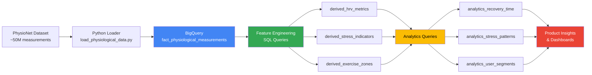
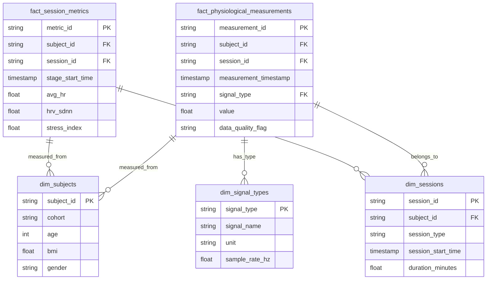
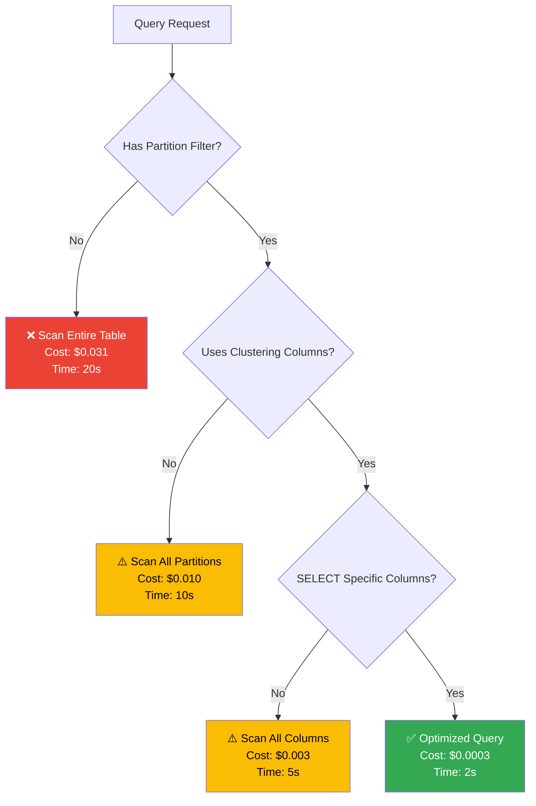
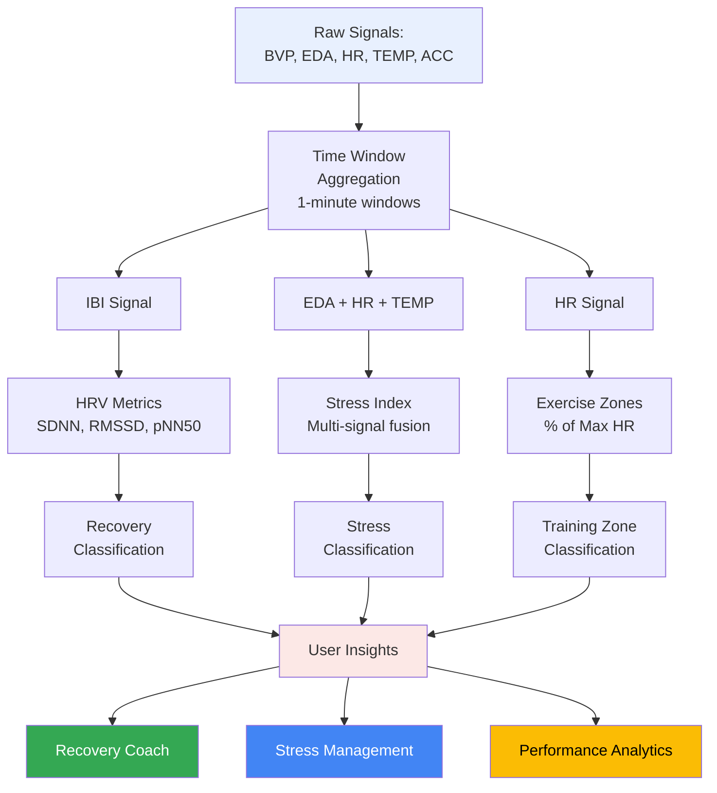

# System Architecture Diagrams

## Overall Data Pipeline


## Star Schema Data Model


## Cost Optimization Strategy


## Feature Engineering Flow


## User Segmentation Logic
```mermaid
graph TD
    A[User Data] --> B{Exercise Performance}
    
    B -->|High Intensity<br/>Good Recovery| C[ATHLETE<br/>→ Performance Analytics]
    B -->|Low HRV<br/>Poor Recovery| D[RECOVERY_FOCUSED<br/>→ Recovery Coach]
    B -->|High Stress| E[STRESS_MANAGEMENT<br/>→ Stress Tracking]
    B -->|Low Activity| F[BEGINNER<br/>→ Guided Programs]
    B -->|Moderate Activity| G[ACTIVE<br/>→ Social Features]
    B -->|Minimal Data| H[CASUAL<br/>→ Simple Tracking]
    
    style C fill:#34a853,color:#fff
    style D fill:#4285f4,color:#fff
    style E fill:#ea4335,color:#fff
    style F fill:#fbbc04,color:#000
    style G fill:#34a853,color:#fff
    style H fill:#e8eaed
